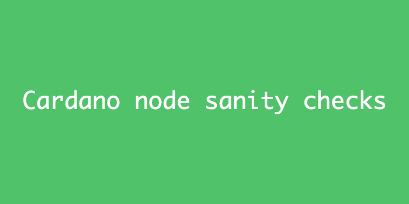
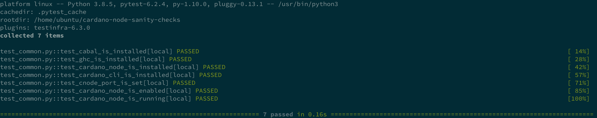
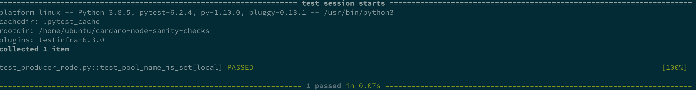

# cardano-node-sanity-checks

Validate cardano node installation

## Description

Installing and configuring a stake pool can be challenging we have found that having a test suite help quickly validate the correctness of pool installation.
We believe this tool will be useful to a lot of operator. The test suite will keep improving. We hope to make it as exhaustive as possible.
At the moment we are focusing on the Guild operator scripts which are tremendous. You can find more information here https://cardano-community.github.io/guild-operators/#/README

## Installation

Check out the current repo

``` shell
sudo apt update
sudo apt-get install python3-venv python3-pip 
python3 -m venv validation
source validation/bin/activate
pip install -r requirements.txt
```

## Usage

The *test_common.py* file contains tests are suitable for both relay and producer.
The *test_producer_node.py* file contains tests specifically for producer node

### For Relay and Producer/Core node

``` shell
py.test -v  test_common.py
```


### For Producer node only

``` shell
py.test -v test_producer_node.py
```

## Donation

If you feel so inclined please delegate some ADA to [ANEW]. It will help fund this project and future community contributions. Your help is much appreciated 

## Contributing

#### Bug Reports & Feature Requests

Please use the [issue tracker](https://github.com/sadaka-io/cardano-node-sanity-checks/issues) to report any bugs or file feature requests.

## Developing

PRs are welcome. To begin developing, do this:

```bash
git clone git@github.com:sadaka-io/cardano-node-sanity-checks.git
py.test -v test_common.py
```
Extend the test suite.
